# Flov7 Documentation

## Overview

Flov7 is a powerful AI-powered workflow automation backend platform that converts natural language instructions into executable workflows. Unlike traditional workflow engines, Flov7 combines:

- AI-driven workflow generation
- Multi-agent reasoning
- Real-time workflow execution
- Enterprise-grade orchestration

**Use Case:** Backend service for complex enterprise workflows (multi-step AI reasoning with APIs, databases, and AI agents).

## Backend Flow Architecture

Flov7's backend architecture combines AI workflow generation with enterprise-grade execution. Below is a comprehensive Mermaid diagram showing the complete flow from user request to deployed workflow.

### User to Temporal to CrewAI Flow

```mermaid
graph TD
    A[👤 User Request] --> B[🤖 OpenAI GPT-4]
    B --> C[📋 5 Primitives]
    C --> D[⚙️ Temporal Orchestrator]
    D --> E[👥 CrewAI Multi-Agent]
    E --> F[🐍 Python Functions]
    F --> G[✅ Workflow Complete]
    
    H[5 Primitives] -.-> C
    H -->|Trigger| C
    H -->|Action| C
    H -->|Connection| C
    H -->|Condition| C
    H -->|Data| C
    
    D -.-> I[🧠 LangGraph]
    D -.-> J[🔗 External APIs]
    D -.-> K[🗄️ Database]
```



### Workflow Execution Pipeline

```mermaid
graph TD
    %% Workflow Start
    A[🎯 Workflow Triggered<br/>Event/Schedule/API Call] --> B[📊 Load Workflow<br/>Supabase Database]
    B --> C[⚙️ Initialize Execution<br/>Temporal Orchestrator]
    
    %% Node Processing Decision
    C --> D{🔀 Node Type?}
    
    %% AI Node Processing
    D -->|🤖 AI Node| E[🧠 LangGraph<br/>Deterministic AI Execution]
    E --> F[⚡ Process Input Data<br/>AI Model Processing]
    F --> G[📝 Generate Output<br/>Structured Response]
    G --> H[💾 Update Status<br/>Execution Results]
    
    %% Multi-Agent Processing
    D -->|👥 Multi-Agent| I[👥 CrewAI<br/>Agent Orchestration]
    I --> J[🎭 Agent Planning<br/>Task Distribution]
    J --> K[🤝 Agent Collaboration<br/>Multi-Agent Reasoning]
    K --> L[📋 Result Aggregation<br/>Combine Agent Outputs]
    L --> H
    
    %% API/DB Node Processing
    D -->|🐍 API/DB| M[🐍 Python Function<br/>External Service Call]
    M --> N[🔗 API Request<br/>HTTP/SOAP/GraphQL]
    N --> O[🗄️ Database Query<br/>SQL/NoSQL Operations]
    O --> P[📊 Data Processing<br/>Transform + Validate]
    P --> H
    
    %% Condition Node Processing
    D -->|🔀 Condition| Q[🔀 Conditional Logic<br/>Decision Branching]
    Q --> R[⚖️ Evaluate Expression<br/>If-Else/Switch/Filter]
    R --> S[🔀 Route to Next Node<br/>Based on Result]
    S --> H
    
    %% Data Node Processing
    D -->|📋 Data| T[📊 Data Transformation<br/>Mapping + Filtering]
    T --> U[🔄 Transform Data<br/>JSON/XML/CSV Processing]
    U --> V[🔗 Enrich Data<br/>Add External Information]
    V --> W[✅ Validate Data<br/>Schema + Quality Checks]
    W --> H
    
    %% Error Handling
    H --> X{❌ Execution Error?}
    X -->|✅ Success| Y[✅ Node Complete<br/>Continue Workflow]
    X -->|❌ Failed| Z[🔄 Retry Logic<br/>Temporal Retry Policy]
    Z --> AA[📧 Error Notification<br/>Alert User/Admin]
    
    %% Real-time Updates
    H -.-> BB[📡 Real-time Update<br/>Supabase Subscriptions]
    BB --> CC[👤 User Dashboard<br/>Live Execution Status]
    
    %% External Service Integration
    F -.-> DD[🔗 External APIs<br/>User's Services]
    N -.-> DD
    O -.-> DD
    U -.-> DD
    V -.-> DD
    
    %% Styling
    classDef triggerClass fill:#e8f5e9,stroke:#388e3c,stroke-width:2px
    classDef decisionClass fill:#f3e5f5,stroke:#7b1fa2,stroke-width:2px
    classDef aiClass fill:#e1f5fe,stroke:#0277bd,stroke-width:2px
    classDef agentClass fill:#fff3e0,stroke:#f57f17,stroke-width:2px
    classDef apiClass fill:#fce4ec,stroke:#c2185b,stroke-width:2px
    classDef conditionClass fill:#f1f8e9,stroke:#33691e,stroke-width:2px
    classDef dataClass fill:#efebe9,stroke:#424242,stroke-width:2px
    classDef resultClass fill:#e8f5e8,stroke:#2e7d32,stroke-width:2px
    classDef errorClass fill:#ffebee,stroke:#d32f2f,stroke-width:2px
    
    class A,B,C triggerClass
    class D decisionClass
    class E,F,G,H aiClass
    class I,J,K,L agentClass
    class M,N,O,P apiClass
    class Q,R,S conditionClass
    class T,U,V,W dataClass
    class X,Y,AA resultClass
    class Z,BB,CC,DD errorClass
```



### Deployment Architecture Flow

```mermaid
graph TD
    %% User Action
    A[👤 User Clicks Deploy<br/>Workflow + Settings] --> B[🚀 Deployment Service<br/>FastAPI Endpoint]
    
    %% Validation Phase
    B --> C[✅ Validation Phase<br/>Workflow Integrity Check]
    C --> D[🔍 Security Validation<br/>Permissions + Compliance]
    D --> E[⚡ Performance Check<br/>Resource Requirements]
    E --> F[🔗 Integration Test<br/>External Service Connectivity]
    
    %% Build Phase
    F --> G[🏗️ Build Phase<br/>Container Generation]
    G --> H[🐳 Docker Image Creation<br/>Optimized Build]
    H --> I[⚙️ Configuration Setup<br/>Environment Variables]
    I --> J[📦 Artifact Packaging<br/>Deployment Ready]
    
    %% Platform Selection
    J --> K[☁️ Platform Selection<br/>Choose Target Platform]
    K --> L[🏠 Vercel<br/>Simple Deployments]
    K --> M[🚂 Railway<br/>Medium Complexity]
    K --> N[☁️ Render<br/>Production Apps]
    K --> O[☁️ AWS/GCP<br/>Enterprise Scale]
    K --> P[☸️ Kubernetes<br/>Advanced Orchestration]
    
    %% Deployment Execution
    L --> Q[🚀 Deploy to Platform<br/>Push + Launch]
    M --> Q
    N --> Q
    O --> Q
    P --> Q
    Q --> R[🌐 Network Configuration<br/>Domains + SSL Setup]
    R --> S[⚙️ Service Startup<br/>Workflow Execution]
    
    %% Verification Phase
    S --> T[🔍 Health Checks<br/>Service Availability]
    T --> U[📊 Monitoring Setup<br/>Logs + Metrics]
    U --> V[📧 Notification Service<br/>Deployment Status]
    V --> W[✅ Deployment Complete<br/>Live Workflow URL]
    
    %% User Dashboard
    W --> X[👤 User Dashboard<br/>Manage + Monitor]
    
    %% Error Handling
    C -.-> Y[❌ Validation Error<br/>Fix Workflow Issues]
    Q -.-> Z[❌ Deployment Error<br/>Retry with Fallback]
    T -.-> AA[❌ Health Check Failed<br/>Auto-Recovery]
    
    %% Styling
    classDef userClass fill:#e1f5fe,stroke:#0277bd,stroke-width:2px
    classDef serviceClass fill:#f3e5f5,stroke:#7b1fa2,stroke-width:2px
    classDef validationClass fill:#e8f5e8,stroke:#2e7d32,stroke-width:2px
    classDef buildClass fill:#fff3e0,stroke:#f57f17,stroke-width:2px
    classDef platformClass fill:#fce4ec,stroke:#c2185b,stroke-width:2px
    classDef deployClass fill:#f1f8e9,stroke:#33691e,stroke-width:2px
    classDef successClass fill:#e8f5e8,stroke:#2e7d32,stroke-width:2px
    classDef errorClass fill:#ffebee,stroke:#d32f2f,stroke-width:2px
    
    class A userClass
    class B serviceClass
    class C,D,E,F validationClass
    class G,H,I,J buildClass
    class K platformClass
    class L,M,N,O,P platformClass
    class Q,R,S,T,U,V,W,X deployClass
    class Y,Z,AA errorClass
```



### Service Communication Architecture

```mermaid
graph TD
    %% External Clients
    A[🌐 External Clients<br/>REST API Calls] --> B[🔐 FastAPI Gateway<br/>Authentication + Routing]
    
    %% Authentication & Security
    B --> C[🔒 Auth Service<br/>Supabase Auth + API Keys]
    C --> D[🛡️ Rate Limiting<br/>Request Throttling]
    D --> E[📝 Request Logging<br/>Audit Trail]
    
    %% Workflow Management
    E --> F[📋 Workflow Service<br/>CRUD Operations]
    F --> G[🗄️ Supabase<br/>Data Persistence]
    G --> H[⚡ Redis Cache<br/>Session Management]
    
    %% AI Processing Pipeline
    E --> I[🤖 AI Service<br/>OpenAI Integration]
    I --> J[📋 5 Primitives<br/>Workflow Generation]
    J --> K[✅ Validation Engine<br/>Logic + Security Checks]
    
    %% Workflow Execution
    F --> L[⚙️ Temporal Service<br/>Workflow Orchestration]
    L --> M[🧠 LangGraph<br/>AI Node Execution]
    L --> N[👥 CrewAI<br/>Multi-Agent Processing]
    L --> O[🐍 Python Functions<br/>API/DB Operations]
    
    %% External Integrations
    M -.-> P[🔗 External APIs<br/>User Services]
    N -.-> P
    O -.-> P
    
    %% Real-time Communication
    G --> Q[📡 Real-time Service<br/>WebSocket + Subscriptions]
    Q --> R[👤 User Clients<br/>Live Updates]
    
    %% Monitoring & Observability
    B -.-> S[📊 Monitoring Service<br/>Metrics + Logs]
    L -.-> S
    I -.-> S
    F -.-> S
    
    %% Deployment Service
    F --> T[🚀 Deployment Service<br/>Container Orchestration]
    T --> U[🐳 Docker Engine<br/>Container Management]
    U --> V[☁️ Cloud Platforms<br/>Deployment Targets]
    
    %% Styling
    classDef clientClass fill:#e1f5fe,stroke:#0277bd,stroke-width:2px
    classDef gatewayClass fill:#f3e5f5,stroke:#7b1fa2,stroke-width:2px
    classDef securityClass fill:#e8f5e8,stroke:#2e7d32,stroke-width:2px
    classDef serviceClass fill:#fff3e0,stroke:#f57f17,stroke-width:2px
    classDef storageClass fill:#fce4ec,stroke:#c2185b,stroke-width:2px
    classDef executionClass fill:#f1f8e9,stroke:#33691e,stroke-width:2px
    classDef realtimeClass fill:#e0f2f1,stroke:#00695c,stroke-width:2px
    classDef monitoringClass fill:#efebe9,stroke:#424242,stroke-width:2px
    classDef deployClass fill:#e8f5e8,stroke:#2e7d32,stroke-width:2px
    
    class A clientClass
    class B gatewayClass
    class C,D,E securityClass
    class F,I,J,K,T serviceClass
    class G,H,Q storageClass
    class L,M,N,O executionClass
    class P externalClass
    class R realtimeClass
    class S monitoringClass
    class U,V deployClass
```



| Component | Technology | Role |
|-----------|------------|--------|
| **API Gateway** | FastAPI | REST APIs and deployment endpoints for workflow management |
| Workflow Orchestration | Temporal (Python SDK) | Executes workflows reliably, manages retries, long-running tasks, and node dependencies |
| AI Node Execution | LangGraph | Handles AI-powered nodes, converts instructions into deterministic outputs |
| Multi-Agent AI | CrewAI | Runs complex multi-agent workflows for reasoning, research, and planning |
| Conversational AI | OpenAI GPT-4 | Direct LLM integration for natural language workflow creation |
| Database & Auth | **Supabase** | Stores flows, metadata, versioning, execution logs with real-time capabilities and built-in authentication |
| Caching & Sessions | Redis | High-performance caching and session management |
| Deployment | Docker | Containerized deployment for one-click workflow deployment |

## Dependencies

| Repository | License | Role in Flov7 |
|------------|---------|---------------|
| tiangolo/fastapi | MIT | REST API framework for workflow management and deployment endpoints |
| temporalio/temporal | Apache 2.0 | Core workflow engine; ensures enterprise-grade execution |
| langchain-ai/langgraph | MIT | AI node orchestration; converts user instructions into actionable nodes |
| joaomdmoura/crewAI | MIT | Multi-agent AI orchestration; handles complex reasoning workflows |
| openai/openai-python | MIT | Direct LLM integration for conversational workflow creation |
| supabase/supabase | Apache 2.0 | Backend-as-a-Service database with real-time capabilities, authentication, and API endpoints |
| redis/redis | BSD-3 | High-performance caching and session management |
| docker/docker | Apache 2.0 | Containerized deployment for one-click workflow deployment |

## Key Features

### Backend API Features

1. **RESTful Workflow APIs** - Comprehensive REST APIs for workflow creation, execution, and monitoring with JSON-based workflow definitions and versioning support

2. **Conversational Workflow Processing** - Convert natural language instructions into structured workflows with support for complex multi-step reasoning and planning.

3. **Direct LLM Integration** - Single LLM powers multiple specialized agents (CrewAI) and handles conversational workflow creation using OpenAI GPT-4.

4. **Real-Time Workflow Execution** - Live workflow status updates via Supabase real-time subscriptions with asynchronous execution and comprehensive logging.

5. **Enterprise-Grade Orchestration** - Temporal-based workflow execution with retries, error recovery, and proper dependency management for both AI and non-AI tasks.

6. **One-Click Deployment** - Instant deployment with Docker containerization, automated scaling, and integrated monitoring.

7. **User Integration Management** - Secure management of user API keys, database connections, and external service integrations.

8. **Subscription-Based Backend Service**
   - Base Plan: $30/month, 1 LLM, small workflows (~50 nodes)
   - Premium Plan: $100–$500/month, 2 LLMs, complex enterprise workflows (~100+ nodes)

### Technical Features

1. **Temporal Orchestration** - Ensures reliable workflow execution, retries, and error handling for both AI and non-AI nodes

2. **AI Node Management** - LangGraph executes AI nodes deterministically while CrewAI handles multi-agent reasoning nodes

3. **Direct LLM Integration** - OpenAI GPT-4 processes natural language instructions and generates workflow primitives

4. **FastAPI Service Layer** - RESTful endpoints for workflow management, deployment, and user integrations

5. **Real-Time Updates** - Supabase real-time subscriptions push workflow changes and enable live monitoring of workflow execution status

6. **Caching & Performance** - Redis provides high-performance caching for AI responses and session management

7. **Containerized Deployment** - Docker enables one-click deployment with automated scaling and monitoring

## 5-Primitives Architecture

Flov7 uses a revolutionary 5-primitives system that enables AI to build any workflow from simple automations to complex enterprise systems.

### The 5 Core Primitives

Flov7 workflows are built using 5 fundamental building blocks that AI can easily understand and combine:

#### 1. 🎯 Trigger - "When should this start?"
Starts workflows based on events, schedules, or conditions.

```json
{
  "type": "trigger",
  "name": "webhook_trigger",
  "config": {
    "url": "/api/webhook",
    "method": "POST"
  }
}
```

#### 2. ⚡ Action - "What should happen?"
Performs operations like API calls, data processing, or AI analysis.

```json
{
  "type": "action",
  "name": "send_email",
  "config": {
    "template": "welcome_email",
    "to": "{{user.email}}"
  }
}
```

#### 3. 🔗 Connection - "How to connect?"
Manages authentication and communication with external services.

```json
{
  "type": "connection",
  "name": "gmail_connection",
  "service": "gmail",
  "credentials": {
    "type": "oauth"
  }
}
```

#### 4. 🔀 Condition - "Should this execute?"
Implements logic for decision making, filtering, and branching.

```json
{
  "type": "condition",
  "name": "user_verification",
  "logic": "user.status == 'active'",
  "if_true": "send_welcome_email",
  "if_false": "send_verification_email"
}
```

#### 5. 📊 Data - "What flows between steps?"
Handles data mapping, transformation, and flow between primitives.

```json
{
  "type": "data",
  "name": "user_mapping",
  "mapping": {
    "webhook.email": "user_email",
    "webhook.name": "user_name"
  }
}
```

### AI Workflow Creation Process

**Natural Language → 5 Primitives → Executable Workflow**


### Hybrid Architecture: Pre-built + AI-Generated

Flov7 uses a hybrid approach combining reliability with flexibility:

```
┌─────────────────────────────────────┐
│         AI Node Generator           │ ← AI creates custom nodes
│   - Natural language processing     │
│   - Code generation                 │
│   - Validation & testing            │
└─────────────────────────────────────┘
                    ↓
┌─────────────────────────────────────┐
│        Primitive Registry           │ ← Pre-built reliable components
│   - Core triggers (webhook, timer)  │
│   - Core actions (HTTP, email)      │
│   - Core connections (API, DB)      │
│   - Core conditions (if/else)       │
│   - Core data flows (mapping)       │
└─────────────────────────────────────┘
                    ↓
┌─────────────────────────────────────┐
│       Template Marketplace          │ ← Community & custom patterns
│   - Pre-built workflow templates    │
│   - Industry-specific automations   │
│   - AI-customizable blueprints      │
└─────────────────────────────────────┘
```

### Workflow Complexity Spectrum

| Complexity Level | Examples | Primitives Used | Creation Time |
|-----------------|----------|-----------------|---------------|
| **Simple** | Welcome emails, notifications | 2-3 primitives | 30 seconds |
| **Medium** | Customer onboarding, data sync | 3-5 primitives | 2 minutes |
| **Complex** | Approval workflows, integrations | 5-10 primitives | 5 minutes |
| **Enterprise** | Multi-system orchestration | 10+ primitives | 10 minutes |
| **Advanced** | AI decision trees, event processing | 15+ primitives with nesting | 15 minutes |

### Benefits of 5-Primitives Approach

- **🎯 AI-Friendly**: AI understands 5 concepts vs 300+ node types
- **⚡ Composable**: 5^10 = 9.7 million possible combinations
- **🔧 Maintainable**: Maintain 5 primitives vs 300+ nodes
- **🚀 Extensible**: Add new primitive types easily
- **💰 Cost-Effective**: Simple pricing model

### Primitive Categories Available

**Triggers**: webhook, schedule, database, manual, api, email, sms, iot

**Actions**: ai_process, api_call, email_send, db_query, notification, transform, wait, custom

**Connections**: gmail, slack, hubspot, database, api, webhook, oauth, api_key

**Conditions**: if_else, filter, switch, loop, compare, regex, json_path

**Data Flows**: mapping, transform, filter, merge, split, enrich, validate

## Workflow Execution Flow

1. User sends instruction via chat.

2. OpenAI GPT-4 parses intent → generates Flow7 JSON using 5 primitives.

3. Flow7 JSON saved in Supabase.

4. FastAPI endpoints handle workflow management and deployment requests.

5. Temporal executes workflow:
AI Node → LangGraph
Multi-Agent Node → CrewAI
API / DB Node → Python function

6. Redis caches AI responses and manages user sessions.

7. Supabase real-time subscriptions update workflow status.

8. User monitors execution through backend APIs and can deploy with one click.

9. Docker containers enable instant deployment to various platforms.

## One-Click Deployment

Flov7 enables users to deploy workflows instantly with a single click, eliminating DevOps complexity and enabling rapid automation deployment.

### Deployment Architecture

```
┌─────────────────┐    ┌──────────────────┐    ┌─────────────────┐
│   User Clicks   │───▶│ Deployment       │───▶│ Execution       │
│   "Deploy"      │    │ Service          │    │ Environment     │
│                 │    │                  │    │                 │
│ - Workflow ID   │    │ - Generate Config│    │ - Docker        │
│ - Environment   │    │ - Build Image    │    │ - Temporal      │
│ - Version       │    │ - Deploy         │    │ - Supabase      │
└─────────────────┘    └──────────────────┘    └─────────────────┘
```

### User Deployment Experience

**From Idea to Live Workflow in Minutes:**

1. ✅ **Workflow Creation** - AI builds workflow using 5 primitives
2. ⏳ **Validation** - System validates workflow logic
3. 🔨 **Build** - Generates optimized deployment configuration
4. 🚀 **Deploy** - Deploys to execution environment
5. 🎯 **Live** - Workflow accessible via unique URL

### Deployment Components

#### 1. 🎯 Deployment Service
Manages the complete deployment lifecycle from validation to live execution.

```python
class DeploymentService:
    def deploy_workflow(self, workflow_id):
        # Validate workflow primitives
        # Generate deployment configuration  
        # Build and deploy execution environment
        # Return deployment URL and status
```

#### 2. 📦 Deployment Templates
Auto-generated configuration files optimized for each workflow.

```yaml
# Auto-generated docker-compose.yml
version: '3.8'
services:
  workflow-executor:
    image: flov7/workflow-runner:latest
    environment:
      - WORKFLOW_ID=${workflow_id}
      - TEMPORAL_HOST=temporal:7233
      - SUPABASE_URL=${supabase_url}
```

#### 3. 🔐 Security & Isolation
- **Container Isolation** - Each workflow runs in separate container
- **Network Security** - Isolated networking per deployment
- **Resource Limits** - CPU/memory limits per workflow
- **Environment Variables** - Secure credential management

### Infrastructure Options

| Platform | Best For | Cost | Setup Time | Scale |
|----------|----------|------|------------|-------|
| **Vercel** | Simple workflows | Low | 5 min | Medium |
| **Railway** | Medium complexity | Medium | 10 min | High |
| **Render** | Production apps | Medium | 15 min | High |
| **AWS/GCP** | Enterprise | High | 1 hour | Unlimited |
| **Kubernetes** | Advanced orchestration | High | 2 hours | Unlimited |

### Deployment Management Dashboard

**Real-time Deployment Monitoring:**
- 🔍 **Live Status** - Deployment progress and health
- 📊 **Performance Metrics** - Execution time, success rate, costs
- 🛠️ **Debugging Tools** - Logs, error tracking, testing
- ⚙️ **Configuration** - Environment variables, scaling settings
- 💰 **Cost Tracking** - Usage and billing per deployment

### Cost Optimization

**Smart Pricing Based on Usage:**
```python
def calculate_deployment_cost(self, workflow):
    base_cost = 0.01  # Base per deployment
    primitive_cost = len(workflow.primitives) * 0.005
    execution_cost = workflow.expected_executions * 0.001
    return base_cost + primitive_cost + execution_cost
```

### Enterprise Features

- **Custom Domains** - White-label deployment URLs
- **SSO Integration** - Enterprise authentication
- **Audit Logs** - Complete deployment history
- **Compliance** - SOC2, GDPR, HIPAA ready
- **SLA Guarantees** - Uptime and performance commitments

### Benefits for Users

- **⚡ Instant Deployment** - From idea to live in minutes
- **🎯 No DevOps Knowledge** - Click deploy, get live URL
- **🔒 Secure by Default** - Isolation and security built-in
- **📈 Auto-Scaling** - Handles traffic spikes automatically
- **💰 Cost Effective** - Pay only for actual usage
- **🛠️ Easy Management** - Monitor and debug from dashboard

### Implementation Roadmap

#### Phase 1: Core Deployment (1 month)
1. ✅ **Deployment Service** - Basic workflow deployment
2. ✅ **Docker Integration** - Container-based execution
3. ✅ **Simple Platform** - Vercel/Railway integration
4. ✅ **Basic Dashboard** - Deployment status monitoring

#### Phase 2: Advanced Features (2 months)
1. ✅ **Multi-Platform Support** - AWS/GCP/Kubernetes
2. ✅ **Advanced Monitoring** - Logs, metrics, debugging
3. ✅ **Template Marketplace** - Deploy common workflows
4. ✅ **Cost Optimization** - Usage-based pricing

#### Phase 3: Enterprise (3 months)
1. ✅ **Custom Domains & SSL** - White-label deployments
2. ✅ **SSO & Compliance** - Enterprise authentication
3. ✅ **Advanced Security** - Audit logs, encryption
4. ✅ **SLA Management** - Uptime and performance guarantees

### Competitive Advantage

**Traditional Workflow Tools:**
- Manual deployment setup
- DevOps knowledge required
- Complex configuration
- Hours to deploy

**Flov7 One-Click:**
- ✅ **Instant deployment**
- ✅ **No technical knowledge needed**
- ✅ **AI-optimized configuration**
- ✅ **Minutes to live workflow**

This makes Flov7 the most accessible enterprise workflow platform, enabling rapid automation deployment for users of all technical levels.

## Implementation Notes

This section outlines best practices and enhancements for robust Flov7 deployment.

### Service Communication & Resilience

**Circuit Breaker Pattern**: Implement circuit breakers between services to prevent cascade failures and improve system reliability.

**Message Queue**: Consider Redis Streams or Apache Kafka for async processing between Workflow and AI services.

**Service Mesh**: Linkerd or Istio for better service-to-service communication and observability.

### Database Optimization

```sql
-- Performance indexes for better query performance
CREATE INDEX CONCURRENTLY idx_workflows_status_updated ON workflows(status, updated_at);
CREATE INDEX CONCURRENTLY idx_workflow_executions_workflow_id ON workflow_executions(workflow_id);
```

### Caching Strategy

- **Redis Caching**: Cache frequently accessed workflow templates and AI responses
- **CDN Integration**: Use CloudFlare for static assets and API responses

### CI/CD Pipeline

- **GitHub Actions/GitLab CI**: Automated testing and deployment pipelines
- **Multi-stage Docker Builds**: Optimized images for better performance
- **Pre-commit Hooks**: Code quality checks before commits

### Local Development Environment

```yaml
# docker-compose.dev.yml
version: '3.8'
services:
  api-gateway:
    environment:
      - DEBUG=true
      - LOG_LEVEL=debug
  temporal:
    # Development Temporal setup
```

### Security & Compliance

**Authentication & Authorization**:
- **Supabase Auth** with built-in JWT token management and refresh token rotation
- API Key Management for client applications
- RBAC (Role-Based Access Control) for workflow permissions
- User registration, login, and profile management through Supabase

**Security Best Practices**:
```python
# Rate limiting middleware example
from slowapi import Limiter, _rate_limit_exceeded_handler
from slowapi.util import get_remote_address

limiter = Limiter(key_func=get_remote_address)
```

### Cost Optimization

**LLM Cost Management**:
- Token Usage Tracking: Monitor and log all LLM API calls
- Model Selection Strategy: GPT-3.5-turbo for simple tasks, GPT-4 only when needed
- Response Caching: Cache AI responses for similar queries

**Infrastructure Cost Control**:
- Auto-scaling policies for services based on usage
- Spot instances for non-critical workloads

### Monitoring & Observability

**Comprehensive Logging**:
```python
import structlog

logger = structlog.get_logger()

# Structured logging with context
logger.info("Workflow started", workflow_id=workflow.id, user_id=user.id)
```

**Application Performance Monitoring**:
- Distributed Tracing with OpenTelemetry
- Real User Monitoring for API performance
- Alerting rules for error rates, latency, and costs

### API Design Improvements

**RESTful Design**:
```
/api/v1/           # API versioning
├── /workflows/    # CRUD operations
├── /executions/   # Workflow runs
├── /templates/    # Reusable templates
└── /analytics/    # Usage statistics
```

**Response Format Standardization**:
```json
{
  "status": "success",
  "data": {...},
  "meta": {
    "timestamp": "2024-01-01T12:00:00Z",
    "request_id": "req-12345",
    "version": "v1.0"
  }
}
```

### Documentation Improvements

**Developer Documentation**:
- OpenAPI/Swagger specifications for all endpoints
- Architecture Decision Records (ADRs) for major decisions
- Runbooks for troubleshooting common issues

**User Documentation**:
- Integration guides for REST API usage
- Best practices for workflow design patterns
- Example workflows for common use cases

### Quick Implementation Tips

1. **Environment Configuration** - Separate configs for dev/staging/production
2. **Error Handling** - Consistent HTTP status codes across all services
3. **Request Logging** - Middleware for debugging and monitoring
4. **Health Checks** - `/health` endpoints for all services
5. **Basic Monitoring** - Prometheus metrics for service health

---

This document provides a comprehensive overview of Flov7's powerful backend architecture, including workflow orchestration, AI processing capabilities, real-time features, and deployment considerations.

Flov7 uses Docker Compose for simplified microservices deployment and orchestration with Redis caching and FastAPI endpoints.

### Service Deployment
- **API Gateway** - FastAPI REST endpoints (port 8000)
- **Workflow Service** - Background workflow execution (port 8001)
- **AI Service** - Direct LLM processing and CrewAI agents (port 8002)
- **Redis** - Caching and session management (port 6379)

### Infrastructure Stack
- **FastAPI** - REST API framework for deployment and management endpoints
- **Docker Compose** - Local development and single-node deployment
- **Supabase** - Database, authentication, and real-time features
- **Temporal** - Workflow orchestration
- **Redis** - High-performance caching and session management
- **Optional:** Kubernetes for multi-node scaling when needed

### Environment Configuration
- **Development:** `docker-compose up` (all services on localhost)
- **Production:** Environment variables for service URLs and API keys
- **Monitoring:** Health checks and basic logging per service
- **Caching:** Redis for AI responses and user sessions

### Migration Path
1. Start with all services in Docker Compose with FastAPI
2. Extract individual services to separate containers
3. Add load balancers for high-traffic services
4. Move to Kubernetes only when horizontal scaling is needed
5. Implement Redis clustering for high-availability caching