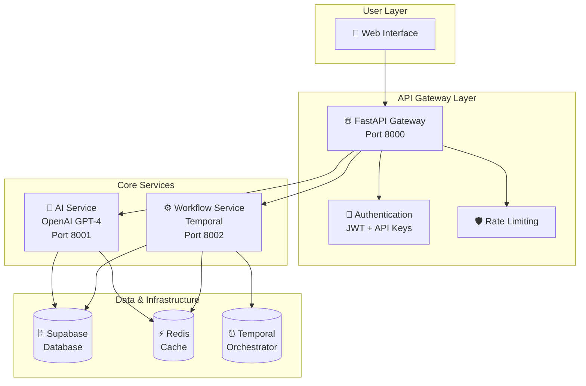

# Flov7 Backend Development Plan - 3 Days

## 🎯 Overview
Complete backend development for Flov7's AI-powered workflow automation platform using Python FastAPI microservices architecture.

## 🏗️ Architecture Overview



## 📁 Project Structure - Microservices Architecture

```mermaid
graph TD
    A[flov7-backend/] --> B[api-gateway/]
    A --> C[ai-service/]
    A --> D[workflow-service/]
    A --> E[shared/]
    A --> F[tests/]
    A --> G[docker/]
    A --> H[docs/]
    A --> I[scripts/]
    
    B --> B1[app/]
    B --> B2[requirements.txt]
    B --> B3[Dockerfile]
    B1 --> B11[__init__.py]
    B1 --> B12[main.py]
    B1 --> B13[config.py]
    B1 --> B14[auth/]
    B1 --> B15[api/]
    B14 --> B141[__init__.py]
    B14 --> B142[supabase_auth.py]
    B14 --> B143[api_key_auth.py]
    B15 --> B151[__init__.py]
    B15 --> B152[v1/]
    B15 --> B153[dependencies.py]
    B152 --> B1521[__init__.py]
    B152 --> B1522[endpoints/]
    B152 --> B1523[router.py]
    
    C --> C1[app/]
    C --> C2[requirements.txt]
    C --> C3[Dockerfile]
    C1 --> C11[__init__.py]
    C1 --> C12[main.py]
    C1 --> C13[config.py]
    C1 --> C14[ai/]
    C1 --> C15[primitives/]
    C1 --> C16[api/]
    C14 --> C141[__init__.py]
    C14 --> C142[openai_client.py]
    C14 --> C143[workflow_generator.py]
    C15 --> C151[__init__.py]
    C15 --> C152[primitives.py]
    C15 --> C153[validation.py]
    
    D --> D1[app/]
    D --> D2[requirements.txt]
    D --> D3[Dockerfile]
    D1 --> D11[__init__.py]
    D1 --> D12[main.py]
    D1 --> D13[config.py]
    D1 --> D14[workflow/]
    D1 --> D15[temporal/]
    D1 --> D16[crewai/]
    D1 --> D17[api/]
    D14 --> D141[__init__.py]
    D14 --> D142[executor.py]
    D14 --> D143[status.py]
    D15 --> D151[__init__.py]
    D15 --> D152[client.py]
    D15 --> D153[workflows.py]
    D16 --> D161[__init__.py]
    D16 --> D162[agents.py]
    D16 --> D163[tasks.py]
    
    E --> E1[models/]
    E --> E2[utils/]
    E --> E3[config/]
    E --> E4[constants/]
    E1 --> E11[__init__.py]
    E1 --> E12[user.py]
    E1 --> E13[workflow.py]
    E1 --> E14[primitive.py]
    E2 --> E21[__init__.py]
    E2 --> E22[helpers.py]
    E2 --> E23[validators.py]
    E3 --> E31[__init__.py]
    E3 --> E32[settings.py]
    E3 --> E33[database.py]
    E4 --> E41[__init__.py]
    E4 --> E42[primitives.py]
    E4 --> E43[status.py]
    
    F --> F1[unit/]
    F --> F2[integration/]
    F --> F3[e2e/]
    F --> F4[conftest.py]
    F --> F5[requirements-test.txt]
    
    G --> G1[docker-compose.yml]
    G --> G2[docker-compose.dev.yml]
    G --> G3[.env.example]
    G --> G4[nginx.conf]
    G --> G5[api-gateway/]
    G --> G6[ai-service/]
    G --> G7[workflow-service/]
    
    H --> H1[api/]
    H --> H2[architecture/]
    H --> H3[deployment/]
    H --> H4[README.md]
    
    I --> I1[setup.sh]
    I --> I2[deploy.sh]
    I --> I3[test.sh]
    I --> I4[lint.sh]
```



## 📅 Day 1: Foundation & API Gateway

### 🎯 Objectives
- Set up project structure
- Implement API Gateway with FastAPI
- Basic authentication and routing
- Database integration

### 📋 Tasks

#### 1. Project Setup (2 hours)
- [ ] Create project structure
- [ ] Initialize virtual environments
- [ ] Install dependencies
- [ ] Set up Git repository

#### 2. API Gateway - FastAPI (4 hours)
- [ ] Create FastAPI application
- [ ] Implement basic routing
- [ ] Add CORS middleware
- [ ] Health check endpoints

#### 3. Authentication System (3 hours)
- [ ] Supabase Auth integration
- [ ] User registration and login
- [ ] API key authentication (supplemental)
- [ ] Session management
- [ ] User profile management
- [ ] Role-based access control

#### 4. Database Integration (3 hours)
- [ ] Supabase client setup
- [ ] Database schema setup
- [ ] CRUD operations for workflows
- [ ] Real-time subscriptions
- [ ] User profile management
- [ ] Integration management

### 🎯 Deliverables
- ✅ Working API Gateway with authentication
- ✅ Basic user management
- ✅ Database connectivity
- ✅ Health endpoints

### 📊 Progress Check
- [ ] All services start without errors
- [ ] Authentication endpoints work
- [ ] Database connections established

---

## 📅 Day 2: AI Service & Workflow Generation

### 🎯 Objectives
- Implement AI workflow generation
- OpenAI GPT-4 integration
- 5-primitives system
- Basic workflow creation

### 📋 Tasks

#### 1. AI Service Setup (2 hours)
- [ ] Create AI service with FastAPI
- [ ] OpenAI client integration
- [ ] Error handling for API calls
- [ ] Rate limiting for AI requests

#### 2. 5-Primitives Implementation (4 hours)
- [ ] Define primitive data structures
- [ ] Create primitive validation
- [ ] Implement primitive composition logic
- [ ] Add primitive templates

#### 3. Workflow Generation Engine (4 hours)
- [ ] Create workflow generation prompts
- [ ] Implement AI-to-workflow conversion
- [ ] Add validation for generated workflows
- [ ] Error handling for invalid workflows

#### 4. Integration Testing (2 hours)
- [ ] Test AI service endpoints
- [ ] Validate workflow generation
- [ ] End-to-end workflow creation test

### 🎯 Deliverables
- ✅ AI service with GPT-4 integration
- ✅ 5-primitives system working
- ✅ Basic workflow generation from text
- ✅ API endpoints for workflow creation

### 📊 Progress Check
- [ ] AI can generate simple workflows
- [ ] 5 primitives are properly defined
- [ ] End-to-end workflow creation works

---

## 📅 Day 3: Workflow Execution & Deployment

### 🎯 Objectives
- Implement workflow execution engine
- Temporal integration
- Basic deployment system
- End-to-end testing

### 📋 Tasks

#### 1. Workflow Execution Service (3 hours)
- [ ] Create workflow service with FastAPI
- [ ] Basic execution engine
- [ ] Workflow status tracking
- [ ] Error handling for failed workflows

#### 2. Temporal Integration (3 hours)
- [ ] Temporal client setup
- [ ] Basic workflow definitions
- [ ] Execution monitoring
- [ ] Retry policies

#### 3. CrewAI Integration (2 hours)
- [ ] CrewAI client setup
- [ ] Multi-agent workflow support
- [ ] Agent communication
- [ ] Result aggregation

#### 4. Basic Deployment System (2 hours)
- [ ] Docker setup for all services
- [ ] docker-compose configuration
- [ ] Basic deployment script
- [ ] Environment configuration

#### 5. Integration Testing (2 hours)
- [ ] End-to-end workflow testing
- [ ] AI to execution pipeline
- [ ] Deployment verification
- [ ] Performance testing

### 🎯 Deliverables
- ✅ Workflow execution working
- ✅ Temporal orchestration functional
- ✅ Basic CrewAI integration
- ✅ Docker deployment ready
- ✅ End-to-end workflow creation and execution

### 📊 Progress Check
- [ ] Complete workflow from AI generation to execution
- [ ] All services communicate properly
- [ ] Docker deployment works
- [ ] Basic monitoring in place

---

## 🎯 Final Deliverables (Day 3 End)

### ✅ Core Functionality
- [ ] **API Gateway**: FastAPI with authentication
- [ ] **AI Service**: OpenAI GPT-4 workflow generation
- [ ] **Workflow Service**: Basic execution engine
- [ ] **Database**: Supabase integration
- [ ] **Authentication**: Supabase Auth + API keys

### ✅ Key Features
- [ ] **5-Primitives System**: Complete primitive implementation
- [ ] **AI Workflow Creation**: Text-to-workflow conversion
- [ ] **Basic Execution**: Simple workflow running
- [ ] **Deployment Ready**: Docker containerization

### ✅ Technical Requirements
- [ ] **Microservices**: 3 services communicating
- [ ] **API Documentation**: OpenAPI/Swagger
- [ ] **Error Handling**: Comprehensive error management
- [ ] **Logging**: Basic logging setup
- [ ] **Testing**: Unit tests for core functions

---

## 🔧 Technical Stack Details

### Dependencies
```python
# API Gateway
fastapi==0.104.1
uvicorn==0.24.0
pydantic==2.5.0
supabase==2.3.0  # Authentication + Database

# AI Service
openai==1.3.7
tiktoken==0.5.2
supabase==2.3.0  # Database access

# Workflow Service
temporalio==1.4.0
crewai==0.1.0
supabase==2.3.0  # Database + Real-time

# Utils
redis==5.0.1
python-dotenv==1.0.0
```

### Environment Variables
```bash
# Supabase (Auth + Database)
SUPABASE_URL=https://your-project.supabase.co
SUPABASE_ANON_KEY=your-supabase-anon-key
SUPABASE_SERVICE_ROLE_KEY=your-service-role-key

# AI Service
OPENAI_API_KEY=your-openai-key

# Workflow Service
TEMPORAL_HOST=localhost:7233
TEMPORAL_NAMESPACE=default

# Infrastructure
REDIS_URL=redis://localhost:6379
```

---

## 🚀 Next Steps (Post Day 3)

### Immediate Priorities
1. **Enhanced AI**: Better prompts and error handling
2. **Advanced Workflows**: Complex multi-step workflows
3. **Monitoring**: Comprehensive logging and metrics
4. **Security**: Advanced authentication and authorization
5. **Performance**: Caching and optimization

### Future Development
1. **Frontend Integration**: React/Angular dashboard
2. **Advanced Deployment**: Multi-platform deployment
3. **Enterprise Features**: SSO, audit logs, compliance
4. **Scaling**: Kubernetes orchestration
5. **Advanced AI**: Custom models and fine-tuning

---

## 📊 Success Metrics

### Day 1 Success
- ✅ API Gateway running on port 8000
- ✅ Authentication working
- ✅ Database connections established
- ✅ Basic CRUD operations functional

### Day 2 Success
- ✅ AI service generating workflows
- ✅ 5-primitives system working
- ✅ OpenAI integration functional
- ✅ Workflow creation from text working

### Day 3 Success
- ✅ End-to-end workflow execution
- ✅ Temporal orchestration working
- ✅ Docker deployment functional
- ✅ All services communicating properly

### Overall Success
- ✅ User can create workflow via text
- ✅ Workflow executes successfully
- ✅ System deploys and runs reliably
- ✅ Basic monitoring and logging in place

---

## ⚠️ Risk Mitigation

### Technical Risks
- **AI API Limits**: Implement caching and rate limiting
- **Temporal Complexity**: Start with simple workflows
- **Database Performance**: Use indexing and connection pooling

### Time Management
- **Scope Control**: Focus on core functionality first
- **Daily Reviews**: End-of-day progress assessment
- **Backup Plans**: Alternative approaches for complex features

### Quality Assurance
- **Testing**: Implement basic unit tests
- **Documentation**: Update README with new features
- **Code Review**: Self-review critical components

---

## 🎯 Final Notes

This 3-day plan provides a **solid foundation** for Flov7's backend while maintaining **realistic scope** and **achievable goals**. The modular microservices architecture allows for easy scaling and feature addition in future development phases.

**Key Focus**: Get the core AI-to-workflow pipeline working end-to-end with basic execution capabilities.
